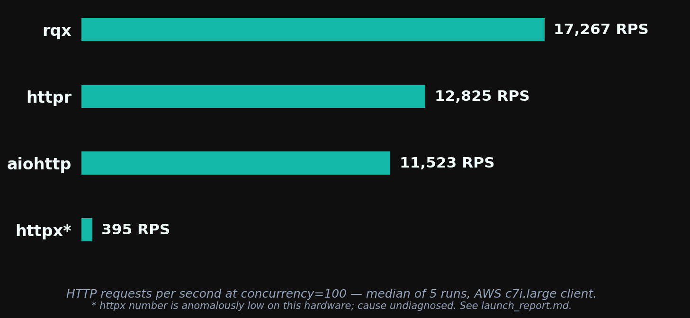
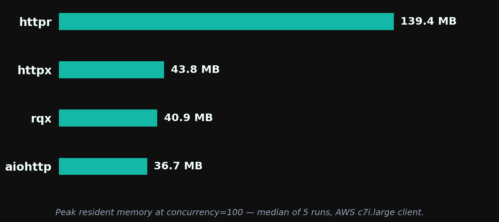
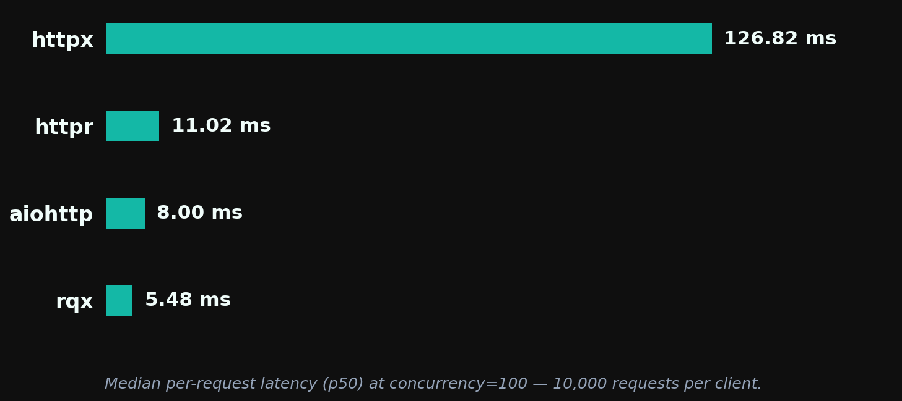

# rqx 0.1.3 — Performance Report

**rqx has the highest throughput and lowest median latency** of the four clients tested (rqx, httpr, aiohttp, httpx), at a memory footprint comparable to aiohttp and ~3.4× lighter than httpr. **aiohttp still wins tail-latency consistency** (p99/p50 of ~1.0–1.1× vs rqx's ~2.0×). Run-to-run variance is lowest for rqx (≤3% at every concurrency) and highest for httpr (up to 49%).

Compared to the [0.1.1 launch run](../../docs/launch_report.md) on identical hardware and harness, rqx throughput is up ~29% at c=100 (13,404 → 17,267 RPS) and ~33% at c=1000 (11,883 → 15,776 RPS), while the other three clients moved <3%. That the comparison set held still is the main reason to read the rqx delta as a real change rather than a difference in machines.

> *These benchmarks are basic and machine-dependent. They are intended as a rough comparison, not a definitive ranking. Results are specific to a 2-vCPU client on AWS c7i.large hitting a same-VPC nginx server over plaintext HTTP/1.1.*

Run: `20260523-151914` · raw logs in [`../results/aws-20260523-v013/`](../results/aws-20260523-v013/)

## Throughput



At concurrency=100, rqx serves 17,267 RPS — 35% above httpr, 50% above aiohttp, and ~44× above httpx (httpx's number is anomalously low; see Limitations).

Median RPS across 5 runs at each concurrency. Spread is min–max as a percentage of the median.

| Client  | c=10             | c=50             | c=100            | c=500            | c=1000           |
| ------- | ---------------- | ---------------- | ---------------- | ---------------- | ---------------- |
| **rqx** | **15,976** ±1%   | **17,357** ±1%   | **17,267** ±1%   | **16,433** ±1%   | **15,776** ±3%   |
| httpr   | 10,840 ±1%       | 11,526 ±49%      | 12,825 ±7%       | 12,330 ±23%      | 11,377 ±25%      |
| aiohttp | 11,494 ±1%       | 11,624 ±2%       | 11,523 ±7%       | 9,240 ±10%       | —                |
| httpx   | 929 ±6%          | 502 ±6%          | 395 ±17%         | 138 ±12%         | 98 ±1%           |

rqx has the highest median RPS at every concurrency tested, and the tightest spread. httpr's ±49% at c=50 and ±23–25% at c≥500 make its single-point numbers hard to lean on — the median is the only stable thing about that column.

rqx peaks at c=50 and degrades ~9% by c=1000 (17,357 → 15,776), a shallower falloff than the ~12% measured at 0.1.1.

## Memory



Peak resident set size (MB), median across 5 runs.

| Client  | c=10      | c=50      | c=100    | c=500    | c=1000   |
| ------- | --------- | --------- | -------- | -------- | -------- |
| **rqx** | **29.4**  | **34.6**  | 41.0     | 78.3     | 101.0    |
| aiohttp | 34.5      | 35.6      | **36.8** | **46.4** | —        |
| httpx   | 34.8      | 39.7      | 43.9     | 50.0     | **63.7** |
| httpr   | 124.6     | 132.4     | 138.7    | 154.4    | 163.0    |

rqx is leanest at c≤50 and essentially tied with aiohttp at c=100 (41.0 vs 36.8 MB). At c=500 aiohttp is meaningfully leaner (46 vs 78 MB); at c=1000 aiohttp's connector deadlocks, so rqx's 101 MB has no aiohttp counterpart.

Against httpr — also reqwest-based, so the closest engine-to-engine comparison — rqx is 3.4× lighter at c=100 and 1.6× lighter at c=1000. That gap is the cost of httpr's sync-on-threadpool model: 1,000+ OS thread stacks resident at high concurrency vs rqx's two tokio worker threads.

httpx's small footprint reflects its low throughput more than any efficiency property.

Memory is up slightly from 0.1.1 (37.1 → 41.0 MB at c=100, 97.4 → 101.0 at c=1000) — roughly 10% more resident for roughly 30% more throughput.

## Latency



Per-request latency at c=100, 10,000 requests per client, median across 5 runs (`b2_latency.py`):

| Client  | p50          | p75          | p95         | p99          | p99.9        | max          |
| ------- | ------------ | ------------ | ----------- | ------------ | ------------ | ------------ |
| **rqx** | **5.48 ms**  | **6.76 ms**  | 9.27 ms     | 12.36 ms     | 15.70 ms     | 20.47 ms     |
| aiohttp | 8.00 ms      | 8.71 ms      | **8.89 ms** | **9.06 ms**  | **15.44 ms** | **16.06 ms** |
| httpr   | 11.02 ms     | 13.69 ms     | 15.50 ms    | 21.56 ms     | 29.36 ms     | 29.66 ms     |
| httpx   | 126.82 ms    | 250.89 ms    | 616.42 ms   | 1,544.64 ms  | 3,191.36 ms  | 4,991.99 ms  |

rqx has the lowest p50 (down from 7.00 ms at 0.1.1) and leads through p75. From p95 outward aiohttp takes over: its p99 is 9.06 ms vs rqx's 12.36 ms. The two converge again at p99.9.

The practical read: rqx is faster for the median request, aiohttp is more predictable for the worst ones.

## Tail consistency under load

p99/p50 ratio across concurrency (`b8_concurrency_sweep.py`, median of 10 samples per cell — 5 log files × 2 internal runs, zero recorded request failures):

| Client      | c=1      | c=10     | c=50     | c=100    |
| ----------- | -------- | -------- | -------- | -------- |
| **aiohttp** | **1.2×** | **1.1×** | **1.1×** | **1.0×** |
| rqx         | **1.2×** | 2.1×     | 2.0×     | 2.0×     |
| httpr       | 1.3×     | 1.9×     | 1.8×     | 1.8×     |
| httpx       | 1.5×     | 5.9×     | 5.6×     | 6.1×     |

aiohttp wins tail consistency at every concurrency above 1, and its ratio is flat — the tail tracks the median almost exactly. rqx sits at ~2.0× and is now marginally *worse* than httpr (1.8×), a reversal from 0.1.1 where the two were tied at 1.8×. Absolute p99 still favors rqx (11.06 ms vs httpr's 13.43 ms at c=100); the ratio is worse because the median improved more than the tail did.

Underlying medians at c=100: rqx p50 5.50 ms / p99 11.06 ms; aiohttp 7.81 / 8.11; httpr 7.62 / 13.43; httpx 133.56 / 803.82.

## Stability

**rqx aborted with a core dump in 1 of 25 measurement subprocesses** (run 3, c=10, `SIGABRT` / exit 134). The abort happened *after* the measurement completed — the run emitted a full valid result line (16,155 RPS, 29.4 MB) and then crashed during interpreter teardown. The harness recorded both the result and a `crashed_exit_134` skip marker for the same cell.

This is a real teardown bug, not a measurement artifact, and it is not reflected anywhere in the tables above (which use the 5 clean result lines for that cell). It did not reproduce in the other 24 rqx subprocesses. Worth reproducing and tracking separately.

No other client crashed. aiohttp's c=1000 deadlock is a hang, not a crash (see Limitations).

## Test setup

- **Client:** AWS c7i.large (2 vCPU, dedicated CPU, 4 GB RAM), Ubuntu 24.04, kernel 6.17.0-1015-aws
- **Server:** AWS c7i.large in the same VPC, nginx serving static `/json`
- **Network:** intra-VPC private IP, no public hop, no TLS
- **Protocol:** HTTP/1.1 plaintext
- **Toolchain:** Python 3.12.3, rustc 1.95.0
- **Each measurement:** 3 s warmup + 15 s timed measure, 5 s cool-down between measurements
- **Connection pool ceiling:** 1,500 connections / 1,500 keepalive idle on every client
- **Body materialization:** explicit `.content` access (or `await resp.read()` for aiohttp) so every client does the same work
- **Isolation:** each (client, concurrency, run) executes in its own Python subprocess — fresh interpreter, event loop, and tokio runtime, so no client's thread pool contaminates another's measurement

Methodology is unchanged from the 0.1.1 launch run; see [launch_report.md](../../docs/launch_report.md) for why the subprocess isolation matters (the earlier single-process design depressed rqx throughput ~50% at c≥50 through scheduler contention with httpr's 1,500-thread pool).

## Limitations

- **Version metadata mismatch.** `metadata.txt` records `rqx_version: 0.1.2` on branch `feat/expanded-streaming-surface` (commit `0c3006e`), because the benchmark ran before the release version bump. This directory is named for the release the code shipped as, not the string the binary reported. The 0.1.2 charts have the same off-by-one.
- **Basic, machine-dependent comparison.** One hardware and workload configuration. Directional, not definitive.
- **Client-CPU-bound.** tokio defaults to `num_cpus` workers (2 here), so this measures client efficiency on a 2-core box, not library ceiling. Larger clients would push higher and rankings might shift.
- **Plaintext HTTP/1.1 only.** No TLS handshake cost, ALPN, or HTTP/2 multiplexing.
- **Synthetic workload.** Static JSON. Chunked encoding, large payloads, and streamed responses may shift results.
- **Five runs per cell** is enough to spot patterns, not to make tight statistical claims. Median + min–max spread, not confidence intervals.
- **httpx numbers remain anomalously low and undiagnosed.** Published httpx-vs-aiohttp comparisons typically show httpx 2–3× slower; ours shows ~30×. Pool limits, HTTP/1.1 parity, and single-client-instance reuse were all verified at launch and the configuration is unchanged. Treat the httpx delta as directional. The comparisons that carry weight are rqx vs httpr (same engine) and rqx vs aiohttp (most popular async client).
- **httpr's variance is large enough to matter** — ±49% at c=50, ±23–25% at c≥500. Its medians are usable; individual runs are not.
- **aiohttp's connector deadlocks at c=1000** under sustained load, reproducibly, in all 5 runs. Cell skipped rather than hang the harness.
- **rqx degrades ~9% from c=50 to c=1000.** Likely GIL contention through the pyo3-async-runtimes bridge as completions back up against the single asyncio thread. Testable on free-threaded Python (3.13t+).
- **Comparison set is limited to four clients.** `aiosonic`, `niquests` (async mode), and others are not included.
- **nginx `worker_connections` still not explicitly raised**, and **TIME_WAIT is not fully cleared** between measurements (5 s cool-down vs 60 s default timeout). No errors observed and ample ephemeral-port headroom, but neither was ruled out at c=1000.

## Reproducing this

```bash
cd benchmarks/infra
bash scripts/bench.sh --runs-per-bench 5
```

Charts are regenerated from a results directory with:

```bash
python benchmarks/plot_bench.py benchmarks/results/aws-20260523-v013/ --out-dir benchmarks/0.1.3
```
