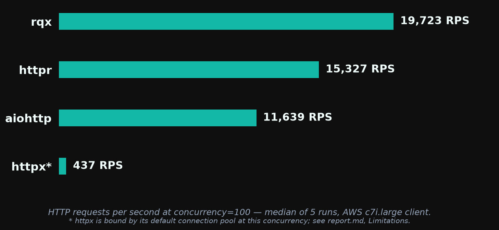
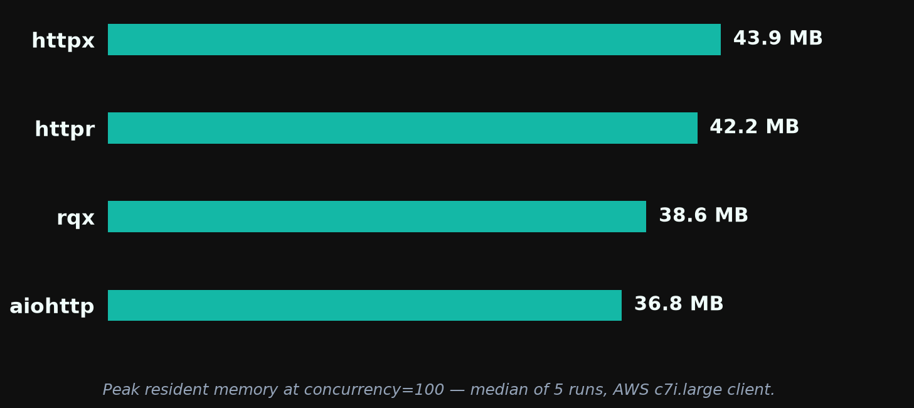
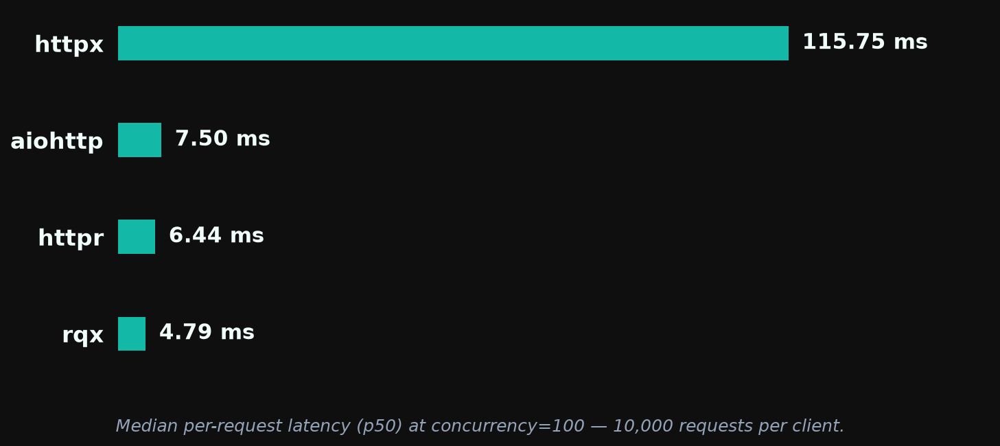

# rqx 0.1.4 — Performance Report

**rqx has the highest throughput and lowest median latency** of the four clients tested (rqx, httpr, aiohttp, httpx) at every concurrency, and the smallest memory footprint up to c=100. **aiohttp still wins tail-latency consistency** (p99/p50 of ~1.0–1.2× vs rqx's ~2.0×), and from c=500 up both aiohttp and the current httpr use less memory than rqx. Run-to-run variance is ≤3% for rqx at every concurrency.

Versus the [0.1.3 run](../0.1.3/report.md), rqx throughput is up 8–14% and peak RSS is down 14–16% at c=500–1000. Most of the throughput delta is the machine, not the code: aiohttp and httpx, unchanged since May, moved +1 to +12% on this box (newer kernel and rustc). The code-attributable gain was measured separately in a same-box A/B on the runtime rewrite (https://github.com/rodcochran/rqx/pull/162): +1.6 to +4.4% rps with the controls flat. The memory drop is real — RSS does not scale with CPU speed.

> *These benchmarks are basic and machine-dependent. They are intended as a rough comparison, not a definitive ranking. Results are specific to a 2-vCPU client on AWS c7i.large hitting a same-VPC nginx server over plaintext HTTP/1.1.*

Run: `20260910-215241` · raw logs in [`../results/aws-20260910-v014/`](../results/aws-20260910-v014/) · rqx at `4b14d36` (main, the v0.1.4 release commit; the binary reports 0.1.3 because the bump lands with the release)

## Throughput



At concurrency=100, rqx serves 19,723 RPS — 29% above httpr, 69% above aiohttp, and ~45× above httpx (httpx's number is anomalously low; see Limitations).

Median RPS across 5 runs at each concurrency. Spread is min–max as a percentage of the median.

| Client  | c=10           | c=50           | c=100          | c=500          | c=1000         |
| ------- | -------------- | -------------- | -------------- | -------------- | -------------- |
| **rqx** | **17,846** ±1% | **19,790** ±1% | **19,723** ±1% | **17,725** ±3% | **17,464** ±3% |
| httpr   | 13,086 ±2%     | 15,055 ±2%     | 15,327 ±2%     | 14,605 ±3%     | 13,721 ±2%     |
| aiohttp | 12,321 ±16%    | 12,387 ±1%     | 11,639 ±8%     | 8,660 ±4%      | —              |
| httpx   | 1,009 ±4%      | 562 ±5%        | 437 ±7%        | 154 ±23%       | 101 ±1%        |

rqx's lead over the best other client (httpr at every concurrency): +37% at c=10, +31% at c=50, +29% at c=100, +21% at c=500, +27% at c=1000.

### Versus 0.1.3

| c    | rqx 0.1.3 | rqx 0.1.4 | Δ rqx  | Δ httpr | Δ aiohttp | Δ httpx |
| ---: | --------: | --------: | -----: | ------: | --------: | ------: |
| 10   | 15,976    | 17,846    | +11.7% | +21%    | +7%       | +9%     |
| 50   | 17,357    | 19,790    | +14.0% | +31%    | +7%       | +12%    |
| 100  | 17,267    | 19,723    | +14.2% | +20%    | +1%       | +11%    |
| 500  | 16,433    | 17,725    | +7.9%  | +18%    | −6%       | +12%    |
| 1000 | 15,776    | 17,464    | +10.7% | +21%    | —         | +3%     |

Read the Δ columns together. aiohttp and httpx are on the same versions as in May, so their movement is the box. httpr is not a control this time: it went from 0.4.8 to 0.7.2 between runs (see Limitations), and its +18 to +31% is mostly its own change.

## Memory



Peak RSS in MB (median of 5 runs), measured via `resource.getrusage` in each client's own subprocess.

| Client  | c=10     | c=50     | c=100    | c=500    | c=1000   |
| ------- | -------- | -------- | -------- | -------- | -------- |
| **rqx** | **29.3** | **33.6** | 38.6     | 66.0     | 84.9     |
| aiohttp | 34.3     | 35.4     | **36.8** | **45.7** | —        |
| httpr   | 34.7     | 38.4     | 42.2     | 51.5     | **57.3** |
| httpx   | 34.8     | 39.4     | 43.9     | 53.5     | 66.2     |

rqx is the lightest client at c=10 and c=50 and within 2 MB of aiohttp at c=100. At c=500 and c=1000 it is the heaviest of the three fast clients: rqx holds per-connection state for every in-flight request as a tokio task plus a pooled connection, and the pool is sized to the concurrency (`max_connections=1500` in `b1_rqx.py`). Versus 0.1.3, rqx's own RSS is down at every concurrency — 77.5 → 66.0 MB at c=500, 101.0 → 84.9 MB at c=1000.

The 0.1.3 report's "3.4× lighter than httpr" no longer holds: httpr 0.7.2 uses 35–57 MB where 0.4.8 used 125–163 MB. That is httpr's change, not rqx's.

## Latency



Per-request latency at c=100, 10,000 requests per client, median across 5 runs (`b2_latency.py`):

| Client  | p50         | p75         | p95         | p99          | p99.9        | max          |
| ------- | ----------- | ----------- | ----------- | ------------ | ------------ | ------------ |
| **rqx** | **4.79 ms** | **5.90 ms** | **8.14 ms** | 12.33 ms     | 17.85 ms     | 20.36 ms     |
| httpr   | 6.44 ms     | 8.04 ms     | 10.28 ms    | 11.55 ms     | **13.26 ms** | **15.01 ms** |
| aiohttp | 7.50 ms     | 8.13 ms     | 8.32 ms     | **8.52 ms**  | 14.89 ms     | 15.75 ms     |
| httpx   | 115.75 ms   | 227.32 ms   | 583.93 ms   | 1,423.66 ms  | 3,072.81 ms  | 4,747.35 ms  |

rqx leads through p95. From p99 outward aiohttp and httpr are both ahead: aiohttp's p99 is 8.52 ms vs rqx's 12.33 ms. Versus 0.1.3, rqx's p50 improved (5.48 → 4.79 ms) while its p99 did not move (12.36 → 12.33 ms) — the tail is a delivery-path property, explained under Tail consistency, and is tracked in https://github.com/rodcochran/rqx/issues/168.

## Tail consistency under load

p99/p50 ratio across concurrency (`b8_concurrency_sweep.py`, median of 10 samples per cell — 5 log files × 2 internal runs, zero recorded request failures):

| Client      | c=1      | c=10     | c=50     | c=100    |
| ----------- | -------- | -------- | -------- | -------- |
| **aiohttp** | 1.4×     | **1.2×** | **1.1×** | **1.0×** |
| rqx         | **1.3×** | 2.1×     | 2.0×     | 1.9×     |
| httpr       | **1.3×** | 1.8×     | 1.8×     | 1.8×     |
| httpx       | 1.8×     | 8.2×     | 5.6×     | 6.3×     |

Underlying medians at c=100: rqx p50 4.88 ms / p99 9.41 ms; aiohttp 7.41 / 7.79; httpr 6.56 / 11.57; httpx 125.26 / 747.85. rqx has the lowest absolute p50 and, against httpr, the lowest p99 at every concurrency; aiohttp's p99 is lower than rqx's from c=10 up.

The ratio is unchanged from 0.1.3 (2.0× then, 1.9–2.1× now) and has a specific cause. Each completed async request is handed to Python from a tokio blocking thread, which must take the GIL; under load the event-loop thread holds it, and CPython yields only every `switchinterval` (5 ms), so completions queue behind the GIL in ~5 ms steps. aiohttp polls its sockets on the loop thread and never crosses a thread. The fix — batch completions into a queue and drain them on the loop thread — is https://github.com/rodcochran/rqx/issues/168.

## Stability

Zero aborts or crashes across 95 b1 cells (aiohttp c=1000 is skipped by design), 5 b2 runs, and 5 b8 runs, with zero recorded request failures. The 0.1.2 and 0.1.3 bench runs hit the interpreter-shutdown abort tracked in https://github.com/rodcochran/rqx/issues/99 three times across their 50 rqx b1 cells; this run, with the runtime lifecycle fix from https://github.com/rodcochran/rqx/pull/162, hit it zero times across 25.

## Test setup

- **Client:** AWS `c7i.large` (2 vCPU, 4 GB), Ubuntu 24.04, kernel `7.0.0-1012-aws`, Python 3.12.3, `rustc 1.98.1`. rqx built from source at `4b14d36` in release mode.
- **Server:** AWS `c7i.large` in the same subnet running nginx (`benchmarks/nginx/`) serving a static 60-byte JSON body over plaintext HTTP/1.1 with keep-alive.
- **Comparison clients:** httpr 0.7.2, aiohttp 3.14.3, httpx 0.28.1, all installed unpinned from PyPI at setup time.
- **Harness:** `benchmarks/infra/scripts/run-benches.sh` — b1 (`run_b1.sh`, each (client, concurrency, run) in its own Python subprocess, 3 s warmup + 15 s measure), b2 (`b2_latency.py`), b8 (`b8_concurrency_sweep.py`), 5 runs each.

## Limitations

- **The comparison box is not the May box.** Kernel 6.17 → 7.0, rustc 1.95 → 1.98.1, and a different physical host. Absolute numbers are not comparable across reports; read rqx's delta next to the unchanged clients' deltas.
- **httpr changed versions between runs (0.4.8 → 0.7.2).** Its `AsyncClient` runs blocking requests on a thread pool; before 0.6.0 that was asyncio's default executor (6 threads on this instance), after it a dedicated 64-thread pool. So the May httpr numbers were self-throttled below the requested concurrency, and its jump here is largely that cap lifting. This run's rqx-vs-httpr lead is the fair one; May's was against a handicapped comparator.
- **httpx is not tuned for this workload.** One shared client and N workers exceeds its default pool (100 connections, 20 keep-alive) from c=100 up, so its c=500 and c=1000 cells measure its pool queue, not the network. Its c=10 and c=100 numbers are representative; the rest overstate the gap.
- **aiohttp at c=1000 is skipped** because its connector deadlocks under the harness at that concurrency; that is a harness interaction, not a verdict on aiohttp.
- **Same-VPC RTT is sub-millisecond,** so every number here is client-CPU-bound. Over a real network the throughput gaps shrink and the latency gaps are dominated by the wire.
- **The S3 upload step failed** (no AWS CLI on the client, https://github.com/rodcochran/rqx/issues/113); results were recovered by `scp`. Comparator versions in `metadata.txt` were recorded by hand; `run-benches.sh` now logs them.

## Reproducing this

```bash
cd benchmarks/infra
pulumi login --local
AWS_PROFILE=<profile> PULUMI_CONFIG_PASSPHRASE="" ./scripts/bench.sh --ref v0.1.4 --skip-destroy
python benchmarks/plot_bench.py benchmarks/infra/results/<run-id>/ --out-dir benchmarks/0.1.4
```
