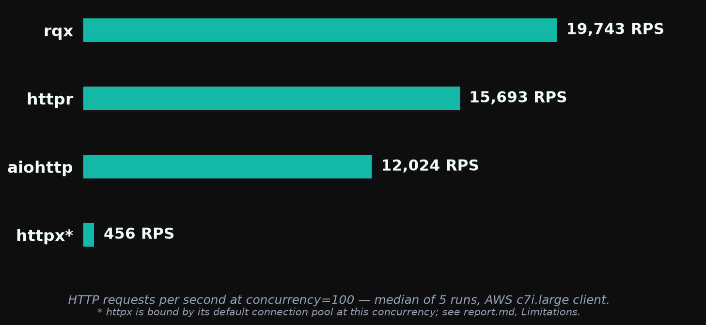
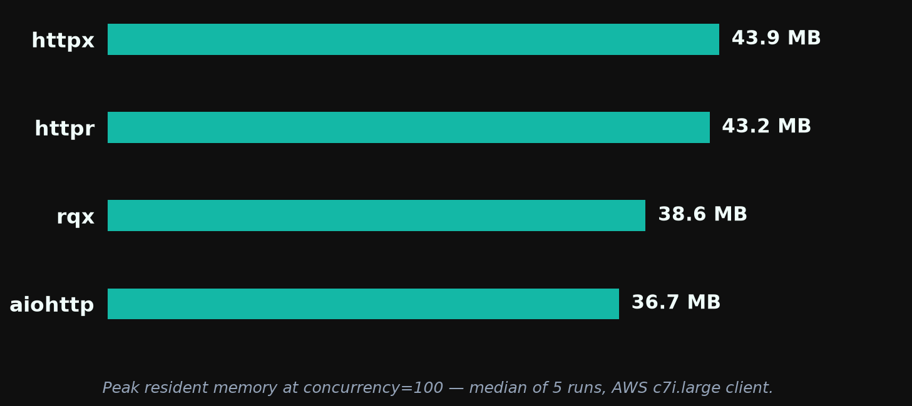
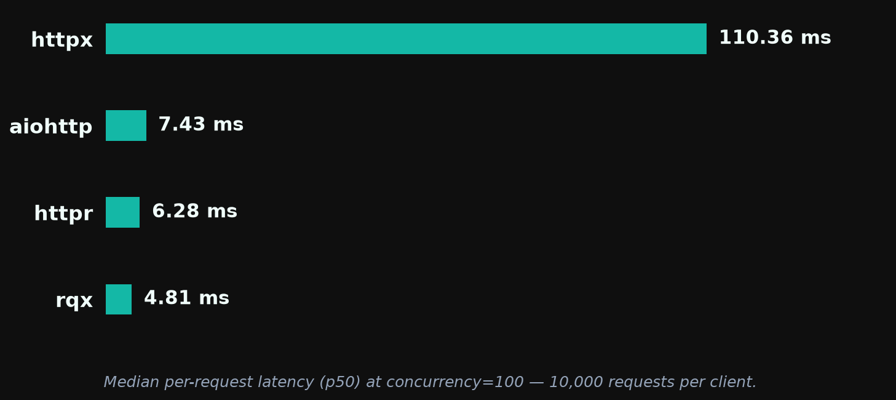

# rqx 0.1.5 — Performance Report

**rqx has the highest throughput and lowest median latency** of the four clients tested (rqx, httpr, aiohttp, httpx) at every concurrency, and the smallest memory footprint up to c=50. **aiohttp still wins tail-latency consistency** (p99/p50 of ~1.0–1.2× vs rqx's ~1.9–2.0×), and from c=500 up both aiohttp and httpr use less memory than rqx. Run-to-run variance is ≤3% for rqx at every concurrency.

**This release is performance-neutral, by design.** 0.1.5 changed how `params=`, `headers=`, and `json=` are validated and encoded at the call boundary and did not touch the send path. Versus the [0.1.4 run](../0.1.4/report.md), the chart cell (c=100) is 19,743 vs 19,723 RPS and peak RSS matches at every concurrency to within half a megabyte. The +7–8% at c=500–1000 is the instance, not the code: httpr and aiohttp moved +10 to +16% at the same levels. The one cell where rqx moved more than most controls is c=10 (−4.7%, controls −1.4% to −5.7%); it is inside the control band but at its edge, and a same-box A/B is the only way to separate a real per-request validation cost from placement noise. It is not a release blocker.

> *These benchmarks are basic and machine-dependent. They are intended as a rough comparison, not a definitive ranking. Results are specific to a 2-vCPU client on AWS c7i.large hitting a same-VPC nginx server over plaintext HTTP/1.1.*

Run: `20260911-231200` · raw logs in [`../results/aws-20260911-v015/`](../results/aws-20260911-v015/) · rqx at `ec80a1f` (main, the v0.1.5 release commit; the binary reports 0.1.4 because the bump lands with the release)

## Throughput



At concurrency=100, rqx serves 19,743 RPS — 26% above httpr, 64% above aiohttp, and ~43× above httpx (httpx's number is anomalously low; see Limitations).

Median RPS across 5 runs at each concurrency. Spread is min–max as a percentage of the median.

| Client  | c=10           | c=50           | c=100          | c=500          | c=1000         |
| ------- | -------------- | -------------- | -------------- | -------------- | -------------- |
| **rqx** | **17,013** ±1% | **19,904** ±1% | **19,743** ±1% | **19,106** ±3% | **18,750** ±1% |
| httpr   | 12,850 ±1%     | 15,213 ±1%     | 15,693 ±2%     | 16,001 ±2%     | 15,204 ±2%     |
| aiohttp | 12,153 ±8%     | 12,262 ±3%     | 12,024 ±2%     | 10,034 ±1%     | —              |
| httpx   | 951 ±2%        | 560 ±3%        | 456 ±2%        | 154 ±14%       | 101 ±0%        |

rqx's lead over the best other client (httpr at every concurrency): +32% at c=10, +31% at c=50, +26% at c=100, +19% at c=500, +23% at c=1000.

### Versus 0.1.4

| c    | rqx 0.1.4 | rqx 0.1.5 | Δ rqx | Δ httpr | Δ aiohttp | Δ httpx |
| ---: | --------: | --------: | ----: | ------: | --------: | ------: |
| 10   | 17,846    | 17,013    | −4.7% | −1.8%   | −1.4%     | −5.7%   |
| 50   | 19,790    | 19,904    | +0.6% | +1.1%   | −1.0%     | −0.3%   |
| 100  | 19,723    | 19,743    | +0.1% | +2.4%   | +3.3%     | +4.4%   |
| 500  | 17,725    | 19,106    | +7.8% | +9.6%   | +15.9%    | 0.0%    |
| 1000 | 17,464    | 18,750    | +7.4% | +10.8%  | —         | +0.5%   |

All three comparison clients are on the same versions as the 0.1.4 run (httpr 0.7.2, aiohttp 3.14.3, httpx 0.28.1), so their columns are pure box: this instance is faster under high concurrency and marginally slower at c=10. Read rqx's Δ against them and the release is flat everywhere. No dependency changed on rqx's side between the two runs either — `Cargo.lock` differs only in the crate version, and rustc is 1.98.1 in both.

## Memory



Peak RSS in MB (median of 5 runs), measured via `resource.getrusage` in each client's own subprocess.

| Client  | c=10     | c=50     | c=100    | c=500    | c=1000   |
| ------- | -------- | -------- | -------- | -------- | -------- |
| **rqx** | **29.3** | **33.8** | 38.6     | 66.5     | 85.0     |
| aiohttp | 34.3     | 35.4     | **36.7** | **46.0** | —        |
| httpr   | 35.1     | 39.2     | 43.2     | 51.8     | **57.7** |
| httpx   | 35.0     | 39.4     | 43.9     | 53.1     | 66.2     |

Identical to 0.1.4 at every concurrency (29.3 / 33.6 / 38.6 / 66.0 / 84.9 then). The three new boundary types (`QueryParams`, `RequestHeaders`, `JsonBody`) replaced intermediate `HashMap`s with direct construction of the wire types, so no allocation was added to the per-request path. rqx is the lightest client at c=10 and c=50 and within 2 MB of aiohttp at c=100; at c=500 and c=1000 it is the heaviest of the three fast clients, for the reason given in the 0.1.4 report (per-connection tokio task plus a pool sized to the concurrency).

## Latency



Per-request latency at c=100, 10,000 requests per client, median across 5 runs (`b2_latency.py`):

| Client  | p50         | p75         | p95         | p99          | p99.9        | max          |
| ------- | ----------- | ----------- | ----------- | ------------ | ------------ | ------------ |
| **rqx** | **4.81 ms** | **5.86 ms** | 8.44 ms     | 12.11 ms     | 18.26 ms     | 19.17 ms     |
| httpr   | 6.28 ms     | 7.77 ms     | 9.91 ms     | 11.24 ms     | **12.72 ms** | 15.31 ms     |
| aiohttp | 7.43 ms     | 8.03 ms     | **8.24 ms** | **8.71 ms**  | 14.49 ms     | **15.11 ms** |
| httpx   | 110.36 ms   | 220.32 ms   | 564.32 ms   | 1,475.45 ms  | 2,858.95 ms  | 4,475.40 ms  |

Unchanged from 0.1.4 within noise for every client (rqx p50 4.79 → 4.81 ms, p99 12.33 → 12.11 ms). rqx leads through p75; from p95 outward aiohttp is ahead, and httpr from p99. The tail is the delivery-path property described under Tail consistency and tracked in https://github.com/rodcochran/rqx/issues/168.

## Tail consistency under load

p99/p50 ratio across concurrency (`b8_concurrency_sweep.py`, median of 10 samples per cell — 5 log files × 2 internal runs, zero recorded request failures):

| Client      | c=1  | c=10     | c=50     | c=100    |
| ----------- | ---- | -------- | -------- | -------- |
| **aiohttp** | 3.3× | **1.2×** | **1.1×** | **1.0×** |
| rqx         | 2.2× | 1.9×     | 2.0×     | 1.9×     |
| httpr       | 2.3× | 1.8×     | 1.8×     | 1.8×     |
| httpx       | 1.5× | 10.7×    | 5.7×     | 6.2×     |

Underlying medians at c=100: rqx p50 4.72 ms / p99 9.08 ms; aiohttp 7.13 / 7.44; httpr 6.22 / 10.92; httpx 116.63 / 715.74. rqx has the lowest absolute p50 at every concurrency and, against httpr, the lowest p99; aiohttp's p99 is lower than rqx's from c=10 up. The ratio is unchanged from 0.1.4 (1.9–2.1× then). The c=1 column is not comparable to the 0.1.4 report: at one in-flight request the numbers are pure round trip, and every client's c=1 p50 is ~0.07 ms higher on this instance pair (0.15 → 0.22 ms for rqx, the same shift for httpr and aiohttp), which is network placement, not code.

## Stability

Zero aborts or crashes across 95 b1 cells (aiohttp c=1000 is skipped by design), 5 b2 runs, and 5 b8 runs, with zero recorded request failures. Second consecutive clean run since the runtime lifecycle fix in 0.1.4.

## Test setup

- **Client:** AWS `c7i.large` (2 vCPU, 4 GB), Ubuntu 24.04, kernel `7.0.0-1012-aws`, Python 3.12.3, `rustc 1.98.1`. rqx built from source at `ec80a1f` in release mode.
- **Server:** AWS `c7i.large` in the same subnet running nginx (`benchmarks/nginx/`) serving a static 60-byte JSON body over plaintext HTTP/1.1 with keep-alive.
- **Comparison clients:** httpr 0.7.2, aiohttp 3.14.3, httpx 0.28.1, all installed unpinned from PyPI at setup time and recorded in `metadata.txt`.
- **Harness:** `benchmarks/infra/scripts/run-benches.sh` — b1 (`run_b1.sh`, each (client, concurrency, run) in its own Python subprocess, 3 s warmup + 15 s measure), b2 (`b2_latency.py`), b8 (`b8_concurrency_sweep.py`), 5 runs each.

## Limitations

- **Same kernel and toolchain as 0.1.4, but a different instance pair.** Absolute numbers still move a few percent between runs on identical software; read rqx's delta next to the unchanged clients' deltas, as in the Versus table.
- **httpx is not tuned for this workload.** One shared client and N workers exceeds its default pool (100 connections, 20 keep-alive) from c=100 up, so its c=500 and c=1000 cells measure its pool queue, not the network. Its c=10 and c=100 numbers are representative; the rest overstate the gap.
- **aiohttp at c=1000 is skipped** because its connector deadlocks under the harness at that concurrency; that is a harness interaction, not a verdict on aiohttp.
- **Same-VPC RTT is sub-millisecond,** so every number here is client-CPU-bound. Over a real network the throughput gaps shrink and the latency gaps are dominated by the wire.
- **The S3 upload step failed** (no AWS CLI on the client, https://github.com/rodcochran/rqx/issues/113); results were recovered by `scp`. The first attempt of this session also failed in client setup because the `dev` extra it installed was replaced by dependency groups in 0.1.5; `client-setup.sh` now installs maturin explicitly.

## Reproducing this

```bash
cd benchmarks/infra
pulumi login --local
AWS_PROFILE=<profile> PULUMI_CONFIG_PASSPHRASE="" ./scripts/bench.sh --ref v0.1.5 --skip-destroy
python benchmarks/plot_bench.py benchmarks/infra/results/<run-id>/ --out-dir benchmarks/0.1.5
```
