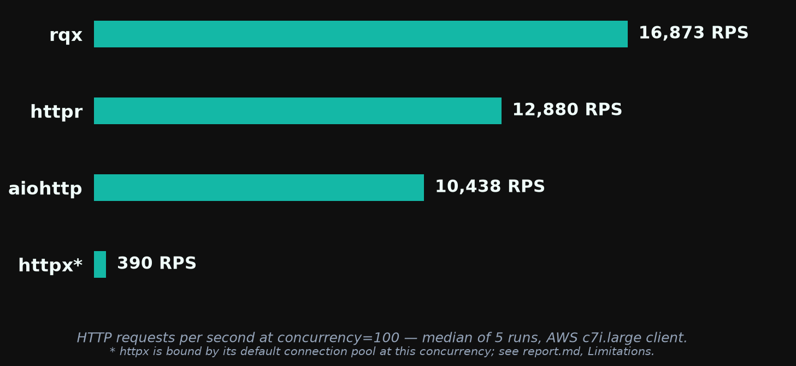
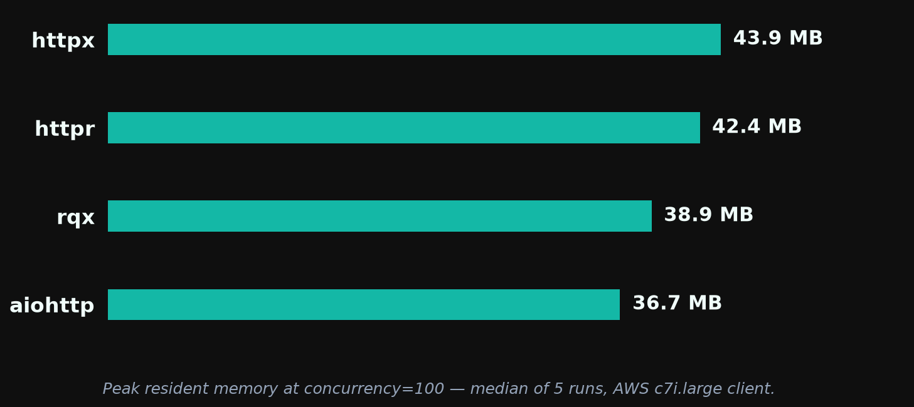
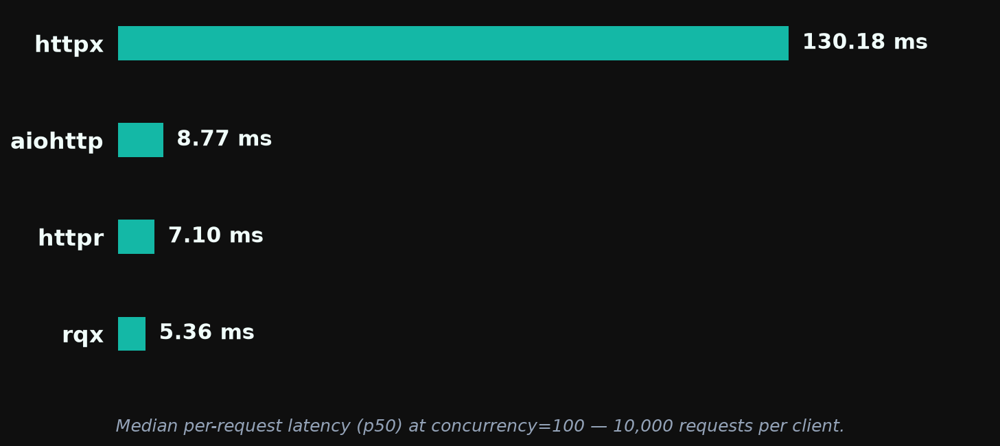

# rqx 0.2.0 — Performance Report

**rqx has the highest throughput and lowest median latency** of the four clients tested (rqx, httpr, aiohttp, httpx) at every concurrency, and the smallest memory footprint up to c=50. **aiohttp still wins tail-latency consistency** (p99/p50 of ~1.1× vs rqx's ~1.9–2.2×), and from c=500 up both aiohttp and httpr use less memory than rqx.

**This release is performance-neutral, by design.** 0.2.0 changed the exception hierarchy and how failures are classified after they happen; nothing on the send path changed. **Every absolute number in this run is lower than the [0.1.5 run](../0.1.5/report.md), for every client.** The instance pair was slower: httpr, aiohttp and httpx moved −7 to −25% on the same software, and rqx moved with them, within two points of httpr at every concurrency. Read this report by rqx's lead over the other clients, which is unchanged or slightly up: +35 / +32 / +31 / +21 / +22% over httpr at c=10…1000, against +32 / +31 / +26 / +19 / +23% in 0.1.5.

> *These benchmarks are basic and machine-dependent. They are intended as a rough comparison, not a definitive ranking. Results are specific to a 2-vCPU client on AWS c7i.large hitting a same-VPC nginx server over plaintext HTTP/1.1.*

Run: `20260912-182933` · raw logs in [`../results/aws-20260912-v020/`](../results/aws-20260912-v020/) · rqx at `bd8df2f` (main after the 0.2.0 exception work; the binary reports 0.1.5 because the bump lands with the release)

## Throughput



At concurrency=100, rqx serves 16,873 RPS — 31% above httpr, 62% above aiohttp, and ~43× above httpx (httpx's number is anomalously low; see Limitations).

Median RPS across 5 runs at each concurrency. Spread is min–max as a percentage of the median.

| Client  | c=10           | c=50           | c=100          | c=500           | c=1000         |
| ------- | -------------- | -------------- | -------------- | --------------- | -------------- |
| **rqx** | **15,876** ±8% | **17,630** ±5% | **16,873** ±5% | **15,104** ±13% | **14,644** ±4% |
| httpr   | 11,777 ±6%     | 13,334 ±5%     | 12,880 ±11%    | 12,478 ±8%      | 11,983 ±4%     |
| aiohttp | 10,941 ±11%    | 10,981 ±2%     | 10,438 ±7%     | 7,566 ±13%      | —              |
| httpx   | 883 ±5%        | 519 ±12%       | 390 ±14%       | 132 ±13%        | 98 ±1%         |

rqx's lead over the best other client (httpr at every concurrency): +35% at c=10, +32% at c=50, +31% at c=100, +21% at c=500, +22% at c=1000.

Run-to-run spread is wider than the 0.1.5 run for every client (rqx ±4–13% vs ±1–3%), which is another property of this instance pair.

### Versus 0.1.5

| c    | rqx 0.1.5 | rqx 0.2.0 | Δ rqx  | Δ httpr | Δ aiohttp | Δ httpx |
| ---: | --------: | --------: | -----: | ------: | --------: | ------: |
| 10   | 17,013    | 15,876    | −6.7%  | −8.4%   | −10.0%    | −7.2%   |
| 50   | 19,904    | 17,630    | −11.4% | −12.4%  | −10.4%    | −7.5%   |
| 100  | 19,743    | 16,873    | −14.5% | −17.9%  | −13.2%    | −14.4%  |
| 500  | 19,106    | 15,104    | −20.9% | −22.0%  | −24.6%    | −14.7%  |
| 1000 | 18,750    | 14,644    | −21.9% | −21.2%  | —         | −2.5%   |

All three comparison clients are on the same versions as the 0.1.5 run (httpr 0.7.2, aiohttp 3.14.3, httpx 0.28.1), so their columns are pure box, and the box is 7–25% slower than last release's at every concurrency. rqx's Δ sits inside the control band at every row. On rqx's side, `Cargo.lock` differs from 0.1.5 only by `hyper` becoming a direct dependency of the crate (the same hyper 1.9.0 reqwest already compiled), and rustc is 1.98.1 in both runs.

## Memory



Peak RSS in MB (median of 5 runs), measured via `resource.getrusage` in each client's own subprocess.

| Client  | c=10     | c=50     | c=100    | c=500    | c=1000   |
| ------- | -------- | -------- | -------- | -------- | -------- |
| **rqx** | **29.5** | **33.7** | 38.9     | 67.7     | 85.5     |
| aiohttp | 34.3     | 35.5     | **36.7** | **46.3** | —        |
| httpr   | 34.9     | 38.8     | 42.4     | 51.0     | **56.8** |
| httpx   | 34.9     | 39.4     | 43.9     | 51.3     | 66.4     |

Within 1.2 MB of 0.1.5 at every concurrency (29.3 / 33.8 / 38.6 / 66.5 / 85.0 then). Memory is the one measure the slower box does not move, which is the cleanest evidence that the code path is the same. rqx is the lightest client at c=10 and c=50 and within 2.2 MB of aiohttp at c=100; at c=500 and c=1000 it is the heaviest of the three fast clients, for the reason given in the 0.1.4 report (per-connection tokio task plus a pool sized to the concurrency).

## Latency



Per-request latency at c=100, 10,000 requests per client, median across 5 runs (`b2_latency.py`):

| Client  | p50         | p75         | p95         | p99          | p99.9        | max          |
| ------- | ----------- | ----------- | ----------- | ------------ | ------------ | ------------ |
| **rqx** | **5.36 ms** | **6.61 ms** | **8.97 ms** | 12.70 ms     | 20.42 ms     | 22.39 ms     |
| httpr   | 7.10 ms     | 8.86 ms     | 11.37 ms    | 12.80 ms     | **14.92 ms** | 18.15 ms     |
| aiohttp | 8.77 ms     | 9.22 ms     | 9.73 ms     | **10.04 ms** | 16.20 ms     | **16.99 ms** |
| httpx   | 130.18 ms   | 251.18 ms   | 629.25 ms   | 1,533.65 ms  | 3,096.06 ms  | 4,966.13 ms  |

Every client's p50 is 0.5–1.3 ms higher than in 0.1.5 (rqx 4.81 → 5.36, httpr 6.28 → 7.10, aiohttp 7.43 → 8.77): the same box shift as throughput. rqx leads through p95; at p99 aiohttp is ahead, with httpr a hair behind rqx. The tail is the delivery-path property described under Tail consistency and tracked in https://github.com/rodcochran/rqx/issues/168.

## Tail consistency under load

p99/p50 ratio across concurrency (`b8_concurrency_sweep.py`, median of 10 samples per cell — 5 log files × 2 internal runs, zero recorded request failures):

| Client      | c=1      | c=10     | c=50     | c=100    |
| ----------- | -------- | -------- | -------- | -------- |
| **aiohttp** | 2.2×     | **1.1×** | **1.1×** | **1.1×** |
| rqx         | **1.3×** | 2.2×     | 2.0×     | 1.9×     |
| httpr       | **1.3×** | 1.9×     | 1.8×     | 1.8×     |
| httpx       | 1.6×     | 8.3×     | 5.7×     | 6.1×     |

Underlying medians at c=100: rqx p50 5.56 ms / p99 10.84 ms; aiohttp 8.27 / 8.91; httpr 7.21 / 12.73; httpx 132.75 / 807.56. rqx has the lowest absolute p50 at every concurrency and, against httpr, the lowest p99; aiohttp's p99 is lower than rqx's from c=10 up. The ratio is unchanged from 0.1.5 (1.9–2.0× then). The c=1 column is pure round trip and flips between runs; on this pair rqx and httpr sit at 0.16 / 0.15 ms p50 and aiohttp's c=1 p99 carried a few slow samples.

## Stability

Zero aborts or crashes across 95 b1 cells (aiohttp c=1000 is skipped by design), 5 b2 runs, and 5 b8 runs, with zero recorded request failures. Third consecutive clean run since the runtime lifecycle fix in 0.1.4.

## Test setup

- **Client:** AWS `c7i.large` (2 vCPU, 4 GB), Ubuntu 24.04, kernel `7.0.0-1012-aws`, Python 3.12.3, `rustc 1.98.1`. rqx built from source at `bd8df2f` in release mode.
- **Server:** AWS `c7i.large` in the same subnet running nginx (`benchmarks/nginx/`) serving a static 1.4 KB JSON body (`response.json`, 1,433 bytes; earlier reports called it 60 bytes, which was wrong) over plaintext HTTP/1.1 with keep-alive.
- **Comparison clients:** httpr 0.7.2, aiohttp 3.14.3, httpx 0.28.1, installed unpinned from PyPI at setup time and recorded in `metadata.txt`.
- **Harness:** `benchmarks/infra/scripts/run-benches.sh` — b1 (`run_b1.sh`, each (client, concurrency, run) in its own Python subprocess, 3 s warmup + 15 s measure), b2 (`b2_latency.py`), b8 (`b8_concurrency_sweep.py`), 5 runs each. First run driven end to end by the per-step scripts (`up`, `run`, `status`, `collect`, `destroy`) that shipped in this release.

## Limitations

- **A slower instance pair than 0.1.5.** Same software, 7–25% lower absolute throughput for every client, and wider run-to-run spread. The Versus table is the only fair reading; a same-box A/B would be the way to measure a change smaller than the placement effect.
- **httpx is not tuned for this workload.** One shared client and N workers exceeds its default pool (100 connections, 20 keep-alive) from c=100 up, so its c=500 and c=1000 cells measure its pool queue, not the network. Its c=10 and c=100 numbers are representative; the rest overstate the gap.
- **aiohttp at c=1000 is skipped** because its connector deadlocks under the harness at that concurrency; that is a harness interaction, not a verdict on aiohttp.
- **Same-VPC RTT is sub-millisecond,** so every number here is client-CPU-bound. Over a real network the throughput gaps shrink and the latency gaps are dominated by the wire.

## Reproducing this

```bash
just benchmarks::setup <aws-profile>        # once
just benchmarks::release 0.2.0 v0.2.0       # ~95 min; results in benchmarks/results/aws-<date>-v020/, charts in benchmarks/0.2.0/
```

See [`../infra/README.md`](../infra/README.md) for the per-step commands and [`../README.md`](../README.md) for what each bench measures.
