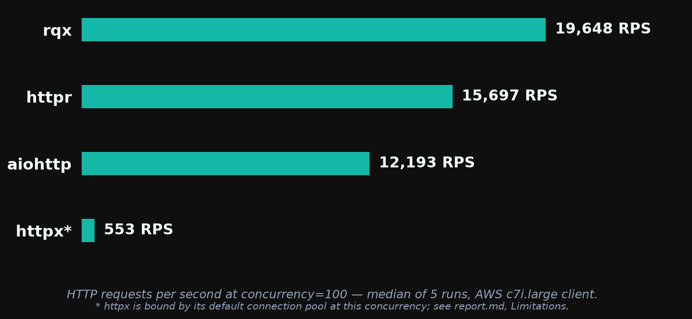
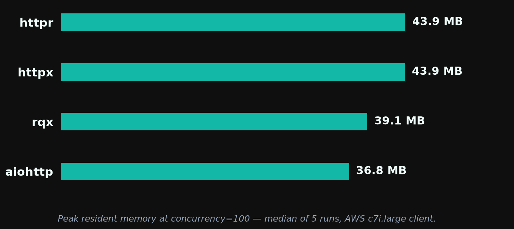
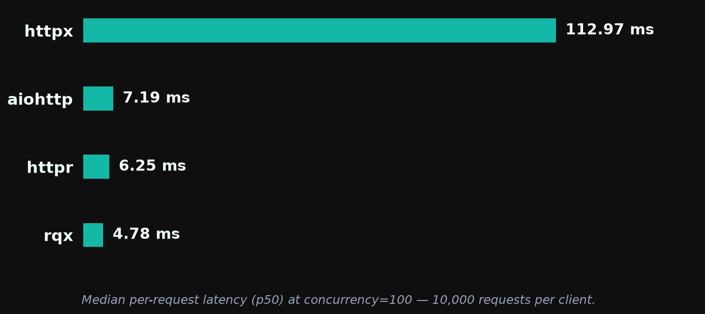

# rqx 0.3.0 — Performance Report

**rqx has the highest throughput and lowest median latency** of the four clients tested (rqx, httpr, aiohttp, httpx) at every concurrency, and the smallest memory footprint up to c=50. **aiohttp still wins tail-latency consistency** (p99/p50 of ~1.1× vs rqx's ~1.8–2.0×), and from c=500 up both aiohttp and httpr use less memory than rqx.

**No regression from this release's code, confirmed on the same machines.** 0.3.0 changed the streaming API, chunking, and the response surface; none of it runs on a successful buffered request except one extra async layer. Against the [0.2.0 run](../0.2.0/report.md) the medians look mixed: rqx rose 12–28% from c=50 up, in line with httpr and aiohttp, but was flat at c=10 while the controls rose 6–11%. A same-box A/B settled it: after this run, `main` without the 0.3.0 response changes was benched on the same instance pair, and once the machine had warmed up the two builds matched within 1% (see *Same-box A/B*). The c=10 gap is this instance pair, not the code.

> *These benchmarks are basic and machine-dependent. They are intended as a rough comparison, not a definitive ranking. Results are specific to a 2-vCPU client on AWS c7i.large hitting a same-VPC nginx server over plaintext HTTP/1.1.*

Run: `20260914-210338` · raw logs in [`../results/aws-20260914-v030/`](../results/aws-20260914-v030/) · rqx at `c5f1305` (the 0.3.0 response and exception work, PR #193; the binary reports 0.2.0 because the bump lands with the release)

## Throughput



At concurrency=100, rqx serves 19,648 RPS — 25% above httpr, 61% above aiohttp, and 36× above httpx.

Median RPS across 5 runs at each concurrency. Spread is min–max as a percentage of the median.

| Client  | c=10           | c=50           | c=100          | c=500           | c=1000          |
| ------- | -------------- | -------------- | -------------- | --------------- | --------------- |
| **rqx** | **15,794** ±6% | **19,749** ±6% | **19,648** ±4% | **19,021** ±14% | **18,697** ±12% |
| httpr   | 12,462 ±5%     | 15,215 ±3%     | 15,697 ±5%     | 16,011 ±8%      | 15,199 ±12%     |
| aiohttp | 12,135 ±6%     | 12,457 ±2%     | 12,193 ±6%     | 9,867 ±18%      | —               |
| httpx   | 995 ±10%       | 665 ±4%        | 553 ±22%       | 421 ±24%        | 395 ±13%        |

rqx's lead over the best other client (httpr at every concurrency): +27% at c=10, +30% at c=50, +25% at c=100, +19% at c=500, +23% at c=1000.

The spreads are wider than 0.2.0's for every client because the instance pair sped up during the first hour of the session: the first three b1 runs were slower than the last two for every client, controls included (httpr at c=10 went 12,231 → 12,878 across the five runs). The medians include those early runs.

### Versus 0.2.0

| c    | rqx 0.2.0 | rqx 0.3.0 | Δ rqx  | Δ httpr | Δ aiohttp | Δ httpx |
| ---: | --------: | --------: | -----: | ------: | --------: | ------: |
| 10   | 15,876    | 15,794    | −0.5%  | +5.8%   | +10.9%    | +12.7%  |
| 50   | 17,630    | 19,749    | +12.0% | +14.1%  | +13.4%    | +28.3%  |
| 100  | 16,873    | 19,648    | +16.5% | +21.9%  | +16.8%    | +41.7%  |
| 500  | 15,104    | 19,021    | +25.9% | +28.3%  | +30.4%    | +219%   |
| 1000 | 14,644    | 18,697    | +27.7% | +26.8%  | —         | +302%   |

Two things moved besides the code, so this table can't be read as a code comparison on its own:

- **A faster instance pair.** The controls rose 6–30% on the same software and versions (httpr 0.7.2, aiohttp 3.14.3, httpx 0.28.1, rustc 1.98.1, no `Cargo.lock` changes).
- **A harness fix.** From this release, b1 warms up on the same client it measures ([#188](https://github.com/rodcochran/rqx/issues/188)); before, the measured client started with an empty pool. That helps every client a little and httpx a lot: its pool bookkeeping grows with the number of connections, so ramping to 500 or 1,000 of them inside the measurement window cost it most of its throughput. The +219% and +302% for httpx are mostly that fix. rqx's lead over httpx at c=1000 is 46×, not the 149× the 0.2.0 run showed.

### Same-box A/B

To separate the code from the box, `main` at `8b160ec` (0.2.0 plus the streaming API and chunking changes, without PR #193's response and exception changes) was benched right after this run on the same instances, b1 × 3. Per-run numbers in time order:

| c   | client | this run, runs 1–5                            | `main`, runs 1–3        |
| --- | ------ | --------------------------------------------- | ----------------------- |
| 10  | rqx    | 15,711 · 15,794 · 15,340 · 16,276 · 16,326    | 16,266 · 16,343 · 16,247 |
| 10  | httpr  | 12,231 · 12,384 · 12,462 · 12,791 · 12,878    | 12,378 · 12,381 · 12,571 |
| 50  | rqx    | 19,749 · 19,364 · 19,325 · 20,247 · 20,447    | 20,145 · 20,219 · 19,701 |
| 100 | rqx    | 19,502 · 19,573 · 20,123 · 19,648 · 20,283    | 20,149 · 20,065 · 20,047 |

Once the machine had settled (runs 4 and 5), this build matches `main` within +0.2% at c=10, +1.0% at c=50 and −0.5% at c=100. Per-run leads over the two controls disagree by up to 3 points between httpr and aiohttp, which is the resolution of this setup; any real cost from the 0.3.0 changes is below that. Raw A/B logs are not archived with the release run; the conclusion is recorded here.

## Memory



Peak RSS in MB (median of 5 runs), measured via `resource.getrusage` in each client's own subprocess.

| Client  | c=10     | c=50     | c=100    | c=500    | c=1000   |
| ------- | -------- | -------- | -------- | -------- | -------- |
| **rqx** | **28.9** | **33.9** | 39.1     | 65.8     | 84.8     |
| aiohttp | 34.3     | 35.4     | **36.8** | **46.2** | —        |
| httpr   | 35.6     | 40.2     | 43.9     | 52.5     | **58.1** |
| httpx   | 34.2     | 39.2     | 43.9     | 56.4     | 66.2     |

Within 1.9 MB of 0.2.0 at every concurrency (29.5 / 33.7 / 38.9 / 67.7 / 85.5 then). rqx is the lightest client at c=10 and c=50 and within 2.3 MB of aiohttp at c=100; at c=500 and c=1000 it is the heaviest of the three fast clients, for the reason given in the 0.1.4 report (per-connection tokio task plus a pool sized to the concurrency).

## Latency



Per-request latency at c=100, 10,000 requests per client, median across 5 runs (`b2_latency.py`):

| Client  | p50         | p75         | p95         | p99         | p99.9        | max          |
| ------- | ----------- | ----------- | ----------- | ----------- | ------------ | ------------ |
| **rqx** | **4.78 ms** | **5.80 ms** | 7.87 ms     | 10.70 ms    | 16.44 ms     | 18.48 ms     |
| httpr   | 6.25 ms     | 7.59 ms     | 9.61 ms     | 10.88 ms    | **12.47 ms** | **15.17 ms** |
| aiohttp | 7.19 ms     | 7.25 ms     | **7.37 ms** | **7.87 ms** | 14.72 ms     | 15.61 ms     |
| httpx   | 112.97 ms   | 231.02 ms   | 602.95 ms   | 1,420.72 ms | 2,937.01 ms  | 4,650.17 ms  |

Every client is 7–18% faster at p50 and p99 than in 0.2.0 (rqx 5.36 → 4.78 ms p50, 12.70 → 10.70 ms p99; aiohttp 8.77 → 7.19 ms p50): the box. b2 runs all four clients in one process at c=100, so it has no c=10 question. rqx leads through p75; aiohttp is ahead from p95 out. The tail is the delivery-path property tracked in https://github.com/rodcochran/rqx/issues/168.

## Tail consistency under load

p99/p50 ratio across concurrency (`b8_concurrency_sweep.py`, median of 10 samples per cell — 5 log files × 2 internal runs, zero recorded request failures):

| Client      | c=1  | c=10     | c=50     | c=100    |
| ----------- | ---- | -------- | -------- | -------- |
| **aiohttp** | 1.7× | **1.2×** | **1.1×** | **1.1×** |
| rqx         | 2.1× | 1.8×     | 2.0×     | 1.9×     |
| httpr       | 2.3× | 1.7×     | 1.8×     | 1.7×     |
| httpx       | **1.3×** | 10.4×    | 5.6×     | 6.0×     |

Underlying medians at c=100: rqx p50 4.90 ms / p99 9.46 ms; aiohttp 7.36 / 7.83; httpr 6.46 / 11.32; httpx 119.75 / 717.22. rqx has the lowest absolute p50 from c=10 up and, against httpr, the lowest p99; aiohttp's p99 is lower than rqx's from c=10 up. rqx's ratio is unchanged from 0.2.0 at c=50 and c=100 (2.0× and 1.9× then). The c=1 column is pure round trip and not comparable to 0.2.0: every client's c=1 p50 roughly doubled on this pair (rqx 0.16 → 0.29 ms), which is the network distance between these two instances.

## Stability

Zero aborts or crashes across 95 b1 cells (aiohttp c=1000 is skipped by design), 5 b2 runs, and 5 b8 runs, with zero recorded request failures. Fourth consecutive clean run since the runtime lifecycle fix in 0.1.4.

## Test setup

- **Client:** AWS `c7i.large` (2 vCPU, 4 GB), Ubuntu 24.04, kernel `7.0.0-1012-aws`, Python 3.12.3, `rustc 1.98.1`. rqx built from source at `c5f1305` in release mode.
- **Server:** AWS `c7i.large` in the same subnet running nginx (`benchmarks/nginx/`) serving a static 1.4 KB JSON body over plaintext HTTP/1.1 with keep-alive.
- **Comparison clients:** httpr 0.7.2, aiohttp 3.14.3, httpx 0.28.1, installed unpinned from PyPI at setup time and recorded in `metadata.txt`.
- **Harness:** `benchmarks/infra/scripts/run-benches.sh` — b1 (`run_b1.sh`, each (client, concurrency, run) in its own Python subprocess, 3 s warmup then 15 s measure on the same client), b2 (`b2_latency.py`), b8 (`b8_concurrency_sweep.py`), 5 runs each. First release run with the same-client b1 warmup.

## Limitations

- **The machine sped up during the session.** The first three b1 runs were slower than the last two for every client. The medians include that; the same-box A/B above reads the settled runs.
- **The harness changed.** b1's warmup now shares the measured client ([#188](https://github.com/rodcochran/rqx/issues/188)). Comparisons against earlier releases mix that change with the code, most visibly for httpx at high concurrency.
- **httpx's numbers are its connection pool's bookkeeping, not the network.** See the [0.2.0 report](../0.2.0/report.md#limitations) for the profile: httpcore 1.0 re-scans every pooled connection when a request is queued or finishes, so per-request CPU grows with the number of open connections.
- **aiohttp at c=1000 is skipped** because its connector deadlocks under the harness at that concurrency; that is a harness interaction, not a verdict on aiohttp.
- **Same-VPC RTT is sub-millisecond,** so every number here is client-CPU-bound. Over a real network the throughput gaps shrink and the latency gaps are dominated by the wire.

## Reproducing this

```bash
just benchmarks::setup <aws-profile>        # once
just benchmarks::release 0.3.0 v0.3.0       # ~95 min; results in benchmarks/results/aws-<date>-v030/, charts in benchmarks/0.3.0/
```

See [`../infra/README.md`](../infra/README.md) for the per-step commands and [`../README.md`](../README.md) for what each bench measures.
