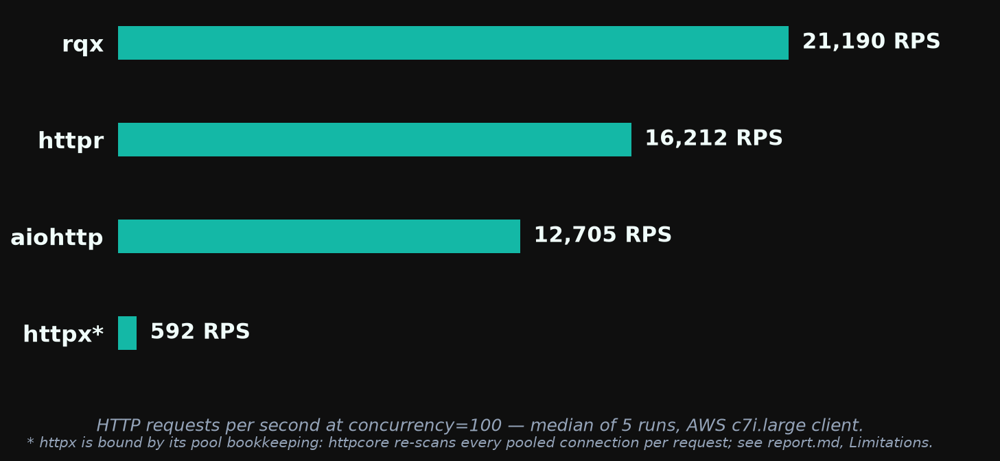
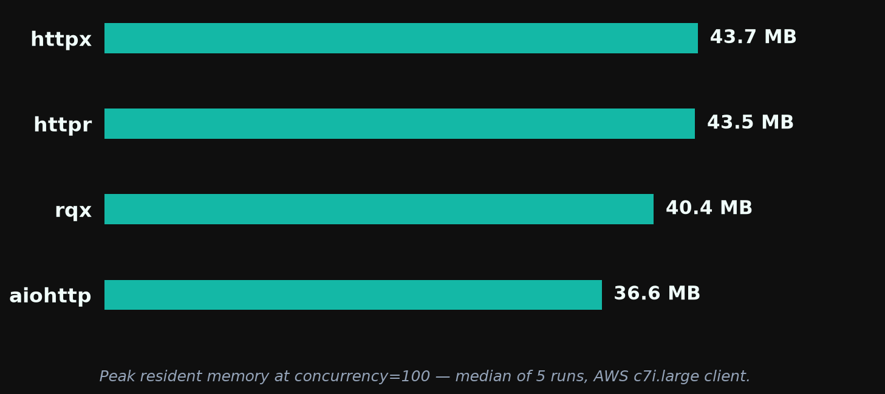
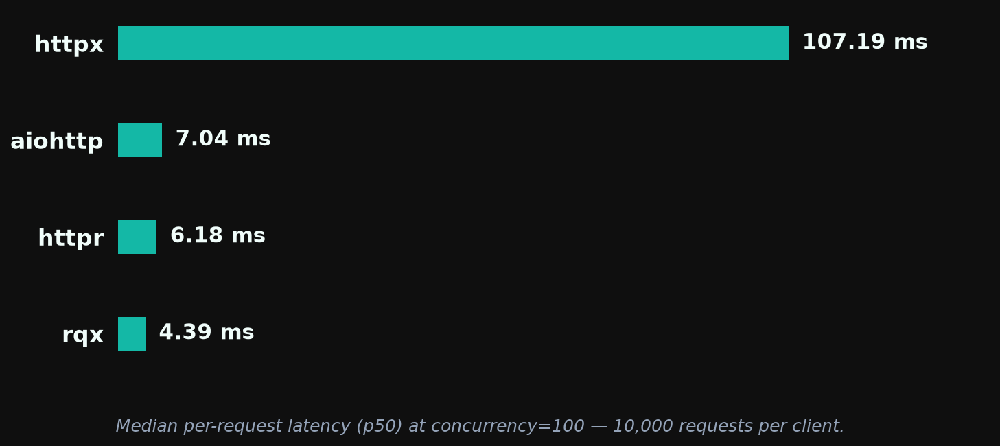

# rqx 0.4.0 — Performance Report

**rqx has the highest throughput** of the four clients tested (rqx, httpr, aiohttp, httpx) at every concurrency, **and the lowest median latency from c=10 to c=100** (tied with aiohttp at c=1; latency is not measured above c=100), and the smallest memory footprint at c=10 and c=50. **aiohttp still wins tail-latency consistency** (p99/p50 of ~1.1× vs rqx's ~1.9–2.1×), and from c=100 up aiohttp, and from c=500 up httpr and httpx, use less memory than rqx.

**Throughput is up 7–14% against 0.3.0, 3.5–7 points more than the machines explain.** This instance pair is faster than 0.3.0's (httpr +3–7%, aiohttp +1–7% on identical versions), and rqx rose more than either at every concurrency. The extra is consistent with fat LTO, which this release turns on to recover the cross-crate inlining the crate split removed (see *Same-box A/B*). **The tables below are the release run, which predates PR #210.** That run found peak memory at c=500 and c=1000 up 9–11 MB against 0.3.0. PR #210 traced it to a wrapper added in PR #202 that stored each in-flight request's async state twice, and fixed it; its same-box A/B puts c=500 back at 0.3.0's level and adds 4.5–7.2% throughput on top of the numbers here (see *Memory* and *Same-box A/B*).

> *These benchmarks are basic and machine-dependent. They are intended as a rough comparison, not a definitive ranking. Results are specific to a 2-vCPU client on AWS c7i.large hitting a same-VPC nginx server over plaintext HTTP/1.1.*

Run: `20260927-231729` · raw logs in [`../results/aws-20260928-v040/`](../results/aws-20260928-v040/) · rqx at `a7c7f33` (`main` with PRs #196, #202 and #204; the binary reports 0.3.0 because the bump lands with the release). PR #210 landed after this run and is measured by its own A/B below; the tables and charts are the build without it.

## Throughput



At concurrency=100, rqx serves 21,190 RPS — 31% above httpr, 67% above aiohttp, and 36× above httpx.

Median RPS across 5 runs at each concurrency. Spread is min–max as a percentage of the median.

| Client  | c=10           | c=50           | c=100          | c=500          | c=1000         |
| ------- | -------------- | -------------- | -------------- | -------------- | -------------- |
| **rqx** | **17,997** ±4% | **21,056** ±3% | **21,190** ±4% | **21,137** ±6% | **20,549** ±3% |
| httpr   | 13,278 ±5%     | 15,682 ±3%     | 16,212 ±3%     | 16,744 ±3%     | 16,065 ±24%    |
| aiohttp | 12,614 ±16%    | 12,629 ±6%     | 12,705 ±5%     | 10,582 ±1%     | —              |
| httpx   | 1,012 ±7%      | 655 ±7%        | 592 ±6%        | 457 ±7%        | 395 ±17%       |

rqx's lead over the best other client (httpr at every concurrency): +36% at c=10, +34% at c=50, +31% at c=100, +26% at c=500, +28% at c=1000.

Spreads are tighter than 0.3.0's for rqx, and there is no session-long drift like 0.3.0's. rqx's first b1 run is its slowest at c=10, c=100 and c=500 (c=100: 20,510, then 21,383 · 21,174 · 21,190 · 21,225), and httpr's first is its slowest at c=100 and c=500: a 1–4% warm-up dip rather than a trend, which the medians step past. httpr's ±24% at c=1000 is one run (12,531 against 15,376–16,432 for the other four), and aiohttp's ±16% at c=10 is its first run (13,971 against 12,014–12,663).

### Versus 0.3.0

| c    | rqx 0.3.0 | rqx 0.4.0 | Δ rqx  | Δ httpr | Δ aiohttp | Δ httpx |
| ---: | --------: | --------: | -----: | ------: | --------: | ------: |
| 10   | 15,794    | 17,997    | +13.9% | +6.6%   | +3.9%     | +1.7%   |
| 50   | 19,749    | 21,056    | +6.6%  | +3.1%   | +1.4%     | −1.5%   |
| 100  | 19,648    | 21,190    | +7.8%  | +3.3%   | +4.2%     | +7.1%   |
| 500  | 19,021    | 21,137    | +11.1% | +4.6%   | +7.2%     | +8.6%   |
| 1000 | 18,697    | 20,549    | +9.9%  | +5.7%   | —         | 0.0%    |

The controls ran the same software as 0.3.0 (httpr 0.7.2, aiohttp 3.14.3, httpx 0.28.1, `rustc` 1.98.1, Python 3.12.3) with the same harness, so their movement is the instance pair: 1–7% faster. rqx beats httpr's movement by 3.5–7.3 points at every concurrency and aiohttp's by 3.6–10.0. httpx moves −1.5% to +8.6%, in the same band as the other controls; rqx's lead over it is 36× at c=100 and 52× at c=1000 (47× in 0.3.0, where httpx was the same 395 RPS).

### Same-box A/B

Two same-box A/Bs cover this release's code, each with 20 alternating pairs per concurrency and the build order flipped per pair, on paired `c7i.large` instances (`benchmarks/infra/scripts/ab.sh`):

- **The crate split and fat LTO (PR #202, run `ab-20260922-220938`, c=10).** Splitting rqx into a pure-Rust core and a binding crate cost 4.25% (split slower in 20/20 pairs): calls from the binding into core became calls across a crate boundary, which the compiler cannot inline without LTO. The same split with the old dependency versions was within 0.4% of the new ones, so the dependency bumps are not a factor. With fat LTO the split build was 4.06% faster than v0.3.0 (20/20 pairs) and its wheel 17% smaller.
- **The configuration refactor (PR #204, run `ab-20260927-171507`, `main` vs the branch).** −0.45% at c=10 (branch faster in 7/20 pairs), +0.31% at c=100 (11/20), −0.05% at c=500 (10/20), peak RSS within 0.7 MB. No detectable effect.
- **The task-future fix (PR #210, run `ab-20260928-013423`, `main` at `a7c7f33` vs the fix at `79ceb2d`).** Measured after the release run, on a fresh instance pair:

  | c    | `a7c7f33` rps | PR #210 rps | median Δ | PR #210 faster | peak RSS `a7c7f33` → PR #210 |
  | ---: | ------------: | ----------: | -------: | -------------: | ---------------------------: |
  | 100  | 19,752        | 20,732      | +4.53%   | 20/20          | 40.7 → 38.2 MB               |
  | 500  | 18,986        | 19,886      | +5.67%   | 19/20          | 74.9 → 65.6 MB               |
  | 1000 | 18,175        | 19,482      | +7.22%   | 20/20          | 104.1 → 90.8 MB              |

  httpr and aiohttp controls moved 2% or less within each block. The throughput gain grows with concurrency, which fits the cause: each in-flight request's task is half the size to allocate and copy (see *Memory*).

The release run's rqx lead over the controls, 3.5–7 points, is in line with the LTO result; PR #210's gain is on top of it. Raw A/B logs are not archived with the release run; the conclusions are recorded here.

## Memory



Peak RSS in MB (median of 5 runs), measured via `resource.getrusage` in each client's own subprocess.

| Client  | c=10     | c=50     | c=100    | c=500    | c=1000   |
| ------- | -------- | -------- | -------- | -------- | -------- |
| **rqx** | **27.6** | **33.9** | 40.4     | 74.7     | 95.4     |
| aiohttp | 34.1     | 35.3     | **36.6** | **46.1** | —        |
| httpr   | 35.3     | 40.3     | 43.5     | 52.4     | **58.6** |
| httpx   | 34.2     | 39.2     | 43.7     | 56.5     | 66.0     |

**In this run, rqx's high-concurrency memory is up against 0.3.0: +8.9 MB (+14%) at c=500 and +10.6 MB (+13%) at c=1000. PR #210, released in 0.4.0, fixes it.** Low concurrency is unchanged or better (c=10 −1.3 MB, c=50 ±0, c=100 +1.3 MB). Every other client is within 0.5 MB of 0.3.0 at every concurrency, so this is rqx, not the machine.

**Cause.** PR #202 changed `Runtime::future_into_py` to convert the caller's error type with an `async move { fut.await.map_err(...) }` wrapper. rustc lays that block out with separate slots for the captured future and the future being awaited, and does not overlap them, so the whole request state was stored twice. Measured with nightly `-Zprint-type-sizes` on release builds, the heap-allocated task per in-flight `AsyncClient` request went from 4,424 bytes in 0.3.0 to 9,400 bytes. PR #210 replaces the wrapper with the `map_err` combinator, which stores the future once: 4,728 bytes (10,840 → 5,448 on the stream-enter path). A unit test pins the wrapper's overhead. Every in-flight request is a tokio task holding that state, so the cost scales with concurrency and was invisible at low c; the dependency bumps and PR #204 were ruled out by earlier A/Bs.

**Effect.** In PR #210's A/B, peak RSS at c=500 went from 74.9 MB, which matches this run's 74.7, to 65.6 MB, level with 0.3.0's 65.8 MB. At c=1000 it dropped 13.3 MB, more than the 10.6 MB regression; the A/B measures for 8 s rather than 15 s, so its c=1000 absolute (104.1 → 90.8 MB) is not directly comparable to this table. The saving is larger than the per-request size difference alone predicts (about 4.7 KB × 500 ≈ 2.3 MB at c=500); the rest is not yet accounted for.

## Latency



Per-request latency at c=100, 10,000 requests per client, median across 5 runs (`b2_latency.py`):

| Client  | p50         | p75         | p95         | p99         | p99.9        | max          |
| ------- | ----------- | ----------- | ----------- | ----------- | ------------ | ------------ |
| **rqx** | **4.39 ms** | **5.50 ms** | 7.65 ms     | 10.20 ms    | 14.43 ms     | 15.95 ms     |
| httpr   | 6.18 ms     | 7.59 ms     | 9.47 ms     | 10.92 ms    | **12.46 ms** | **14.00 ms** |
| aiohttp | 7.04 ms     | 7.10 ms     | **7.19 ms** | **7.65 ms** | 13.67 ms     | 14.44 ms     |
| httpx   | 107.19 ms   | 214.74 ms   | 557.30 ms   | 1,381.62 ms | 3,015.71 ms  | 4,686.34 ms  |

rqx's p50 improved 8.2% against 0.3.0 (4.78 → 4.39 ms) while httpr and aiohttp moved 1–2%; its p99 improved 4.7% (10.70 → 10.20 ms) against −2.8% to +0.4% for the controls. rqx leads through p75; aiohttp is ahead from p95 out. The tail is the delivery-path property tracked in https://github.com/rodcochran/rqx/issues/168, which this release does not touch.

## Tail consistency under load

p99/p50 ratio across concurrency (`b8_concurrency_sweep.py`, median of 10 samples per cell — 5 log files × 2 internal runs, zero recorded request failures):

| Client      | c=1      | c=10     | c=50     | c=100    |
| ----------- | -------- | -------- | -------- | -------- |
| **aiohttp** | 3.7×     | **1.2×** | **1.1×** | **1.1×** |
| rqx         | 2.1×     | 1.9×     | 2.1×     | 2.0×     |
| httpr       | 2.3×     | 1.8×     | 1.8×     | 1.8×     |
| httpx       | **1.4×** | 10.3×    | 5.7×     | 5.9×     |

Underlying medians at c=100: rqx p50 4.62 ms / p99 9.14 ms; aiohttp 7.11 / 7.66; httpr 6.26 / 10.96; httpx 117.84 / 689.65. rqx has the lowest absolute p50 from c=10 up and, against httpr, the lowest p99; aiohttp's p99 is lower than rqx's from c=10 up. rqx's ratios are within 0.1× of 0.3.0's (2.1 / 1.8 / 2.0 / 1.9 then). The c=1 column is round trip on this instance pair: every client's c=1 p50 is about 0.21 ms (0.29 ms on 0.3.0's pair), so it is not comparable across releases, and aiohttp's 3.7× there comes from a handful of slow requests over a 0.21 ms median.

## Stability

Zero aborts or crashes across 95 b1 cells (aiohttp c=1000 is skipped by design), 5 b2 runs, and 5 b8 runs, with zero recorded request failures. Fifth consecutive clean run since the runtime lifecycle fix in 0.1.4.

## Test setup

- **Client:** AWS `c7i.large` (2 vCPU, 4 GB), Ubuntu 24.04, kernel `7.0.0-1013-aws`, Python 3.12.3, `rustc 1.98.1`. rqx built from source at `a7c7f33` in release mode, which since PR #202 means fat LTO and one codegen unit.
- **Server:** AWS `c7i.large` in the same subnet running nginx (`benchmarks/nginx/`) serving a static 1.4 KB JSON body over plaintext HTTP/1.1 with keep-alive.
- **Comparison clients:** httpr 0.7.2, aiohttp 3.14.3, httpx 0.28.1, installed unpinned from PyPI at setup time and recorded in `metadata.txt` — the same versions as 0.2.0 and 0.3.0.
- **Harness:** `benchmarks/infra/scripts/run-benches.sh` — b1 (`run_b1.sh`, each (client, concurrency, run) in its own Python subprocess, 3 s warmup then 15 s measure on the same client), b2 (`b2_latency.py`), b8 (`b8_concurrency_sweep.py`), 5 runs each. Unchanged from 0.3.0.

## Limitations

- **A different instance pair than 0.3.0's,** 1–7% faster by the controls. The *Versus 0.3.0* table reads rqx against those controls, not in absolute terms.
- **The tables and charts predate PR #210.** The shipped 0.4.0 includes it; its effect is measured by the same-box A/B above rather than by a new release run, so shipped high-concurrency memory is lower, and throughput higher, than the tables show.
- **httpx's numbers are its connection pool's bookkeeping, not the network.** httpcore re-scans every pooled connection when a request is queued or finishes, so per-request CPU grows with the number of open connections; see the [0.2.0 report](../0.2.0/report.md#limitations) and https://github.com/rodcochran/rqx/issues/188. The throughput chart's footnote now says so; charts before 0.4.0 carry the earlier, incorrect explanation.
- **aiohttp at c=1000 is skipped** because its connector deadlocks under the harness at that concurrency; that is a harness interaction, not a verdict on aiohttp.
- **Same-VPC RTT is sub-millisecond,** so every number here is client-CPU-bound. Over a real network the throughput gaps shrink and the latency gaps are dominated by the wire.

## Reproducing this

```bash
just benchmarks::setup <aws-profile>        # once
just benchmarks::release 0.4.0 v0.4.0       # ~95 min; results in benchmarks/results/aws-<date>-v040/, charts in benchmarks/0.4.0/
```

See [`../infra/README.md`](../infra/README.md) for the per-step commands and [`../README.md`](../README.md) for what each bench measures.
