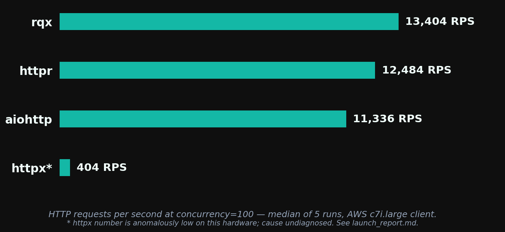
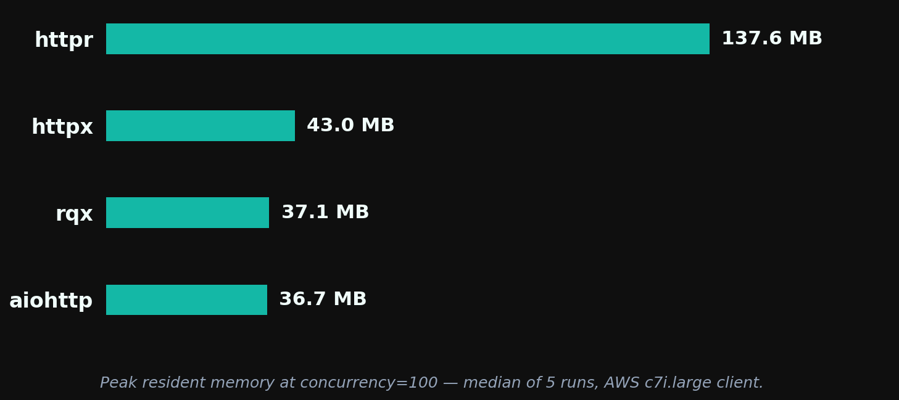
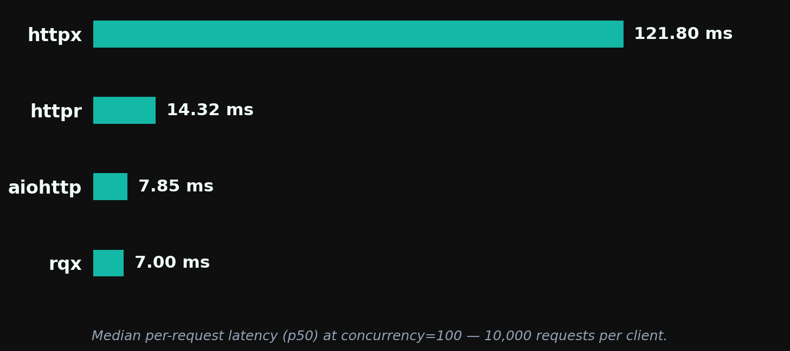

# rqx v0.1.1 — Performance Report

**rqx delivers the highest throughput and lowest median latency** among the four clients tested (rqx, httpr, aiohttp, httpx), with comparable memory to aiohttp at typical concurrency and consistently lighter than httpr (~4× at c≤100, narrowing to ~1.6× at c=1000). **aiohttp wins on tail latency consistency** (p95/p99/p99.9). Run-to-run variance is lowest for rqx (≤5% spread) and highest for httpr (up to 54%).

> *These benchmarks are basic and machine-dependent. They are intended as a rough comparison, not a definitive ranking. Results below are specific to a 2-vCPU client on AWS c7i.large hitting a same-VPC nginx server over plaintext HTTP/1.1.*



At concurrency=100, rqx serves 13,404 RPS — 7% above httpr, 18% above aiohttp, and ~33× above httpx (httpx's number is anomalously low; see Limitations).

## Memory



At c=100, rqx and aiohttp are essentially tied for the smallest footprint (37 MB vs 37 MB). httpr — also reqwest-based, so the closest apples-to-apples comparison — sits at 138 MB. That gap is the cost of httpr's sync-on-threadpool model: 1,000+ OS thread stacks resident at high concurrency vs rqx's two tokio worker threads.

At c=1000, where aiohttp deadlocks and is no longer measurable, rqx holds 97 MB vs httpr's 160 MB — a ~40% reduction while also delivering more throughput.

## Latency



rqx has the lowest **median** per-request latency. At the tail, the story flips: aiohttp's p99 is 8.52 ms vs rqx's 13.38 ms, and aiohttp's p99/p50 ratio of 1.1× is the best of the four. For latency-sensitive services with SLO requirements (where tail behavior matters more than median throughput), aiohttp is competitive with rqx and tighter at the tail.

## Full throughput table

Median RPS across 5 runs at each concurrency. Spread is min–max as a percentage of the median.

| Client  | c=10             | c=50             | c=100            | c=500            | c=1000           |
| ------- | ---------------- | ---------------- | ---------------- | ---------------- | ---------------- |
| **rqx** | **12,887** ±1.9% | **13,504** ±2.4% | **13,404** ±2.8% | **12,436** ±4.7% | **11,883** ±4.0% |
| httpr   | 9,785 ±40%       | 12,287 ±6%       | 12,484 ±54%      | 11,409 ±33%      | 10,547 ±45%      |
| aiohttp | 11,482 ±6%       | 11,579 ±2%       | 11,336 ±11%      | 8,492 ±9%        | —                |
| httpx   | 1,011 ±22%       | 507 ±6%          | 404 ±6%          | 128 ±27%         | 99 ±1%           |

rqx has the highest median RPS at every concurrency level tested. aiohttp's connector deadlocks at c=1000 under sustained load and was skipped.

## Memory at every concurrency

Peak resident set size (MB), median across 5 runs.

| Client  | c=10     | c=50     | c=100    | c=500    | c=1000   |
| ------- | -------- | -------- | -------- | -------- | -------- |
| **rqx** | **27.8** | **32.0** | 37.1     | 69.9     | 97.4     |
| aiohttp | 34.4     | 35.5     | **36.7** | **46.4** | —        |
| httpx   | 33.7     | 38.2     | 43.0     | 48.9     | **62.5** |
| httpr   | 123.1    | 132.4    | 137.6    | 151.5    | 160.3    |

rqx and aiohttp are roughly tied for the smallest footprint at typical concurrency (c≤100). At c=500, aiohttp is leaner (46 MB vs rqx's 70 MB), though aiohttp's connector deadlocks before c=1000 so there's no apples-to-apples comparison at the high end. Against httpr — the closest engine comparison — rqx is 3-4× lighter at every concurrency, growing the gap as concurrency rises. httpx's small footprint reflects its low throughput more than any efficiency claim.

## Latency (concurrency=100, 10,000 requests per client)

Per-request latency from `b2_latency.py`:

| Client  | p50         | p95         | p99         | p99.9        | max          |
| ------- | ----------- | ----------- | ----------- | ------------ | ------------ |
| **rqx** | **7.00 ms** | 10.77 ms    | 13.38 ms    | 18.20 ms     | 21.99 ms     |
| aiohttp | 7.85 ms     | **8.13 ms** | **8.52 ms** | **16.61 ms** | **17.20 ms** |
| httpr   | 14.32 ms    | 22.14 ms    | 32.30 ms    | 34.13 ms     | 34.99 ms     |
| httpx   | 121.80 ms   | 604.15 ms   | 1,516.73 ms | 3,258.99 ms  | 4,575.80 ms  |

rqx has the lowest p50. aiohttp has the tightest tail (only 8% spread between p50 and p99) — the best choice if tail latency matters more than median throughput. httpx is unsuitable at this concurrency (see Limitations re: anomalously low httpx numbers).

## Tail consistency under load

p99/p50 ratio across concurrency levels (`b8_concurrency_sweep.py`, **median of 2 runs** — fewer than the throughput/memory/latency tables above, because the b8 sweep is wider and we ran out of bench-machine time before tear-down. Per-run variance on these p99 numbers was ≤5% for everything except httpx@c=10, which had a single outlier; we don't expect a 5-run re-test to change the rankings):

| Client      | c=1      | c=10     | c=50     | c=100    |
| ----------- | -------- | -------- | -------- | -------- |
| **aiohttp** | 1.3×     | **1.2×** | **1.1×** | **1.1×** |
| rqx         | **1.2×** | 1.8×     | 1.7×     | 1.8×     |
| httpr       | 1.3×     | 1.9×     | 1.8×     | 1.8×     |
| httpx       | 1.4×     | 3.0×     | 5.7×     | 5.9×     |

aiohttp wins tail consistency. rqx ties httpr at ~1.8× and dominates httpx at every concurrency.

## Test setup

- **Client:** AWS c7i.large (2 vCPU, dedicated CPU, 4 GB RAM), Ubuntu 24.04
- **Server:** AWS c7i.large in the same VPC, nginx 1.27 (alpine) serving static `/json`
- **Network:** intra-VPC private IP, no public hop, no TLS
- **Protocol:** HTTP/1.1 plaintext
- **Each measurement:** 3 s warmup + 15 s timed measure. 5 s cool-down between measurements.
- **Connection pool ceiling:** 1,500 connections / 1,500 keepalive idle on every client.
- **Body materialization:** explicit `.content` access (or `await resp.read()` for aiohttp) so every client does the same work.

## Methodology — why this benchmark is worth trusting

Our first attempt placed all four clients in a single Python process, taking turns. Each measurement had the others' state polluting the process — most notably, httpr requires a 1,500-thread `ThreadPoolExecutor` to scale, and those threads stay alive throughout the entire run. With rqx and httpr both spawning tokio runtimes in the same process, scheduler contention on the 2-vCPU box was depressing rqx's throughput by ~50% at c≥50.

The benchmark used here runs each (client, concurrency, run) in its own Python subprocess: fresh interpreter, fresh asyncio event loop, fresh tokio runtime, no foreign thread pools. Per-process peak RSS is attributable to a single client. The 5-second cool-down between subprocesses gives kernel TCP state and TIME_WAIT slots time to settle.

After the change, rqx's run-to-run spread dropped to under 3% — small enough that the lead over aiohttp and httpr is clearly real, not noise.

Source: `benchmarks/b1_{rqx,httpr,httpx,aiohttp}.py` (one file per client) and `benchmarks/run_b1.sh` (the driver).

## Limitations

- **Basic, machine-dependent comparison.** These are rough numbers from one specific hardware and workload configuration. Treat them as directional, not definitive. Real production results will depend on payload size, network topology, TLS, and CPU count.
- **Client-CPU-bound.** Server CPU was at ~35% during rqx's measurements (`server_top_b1v2.log`), so absolute throughput is bounded by the 2-vCPU client, not nginx. tokio defaults to `num_cpus` workers (2 here), so we're explicitly benchmarking "client efficiency on a 2-core box," not "library ceiling." Larger client instances would push higher; the rankings might shift.
- **Plaintext HTTP/1.1 only.** TLS handshake cost, ALPN negotiation, and HTTP/2 multiplexing are not measured here.
- **Synthetic workload.** Static JSON responses. Real bodies (chunked encoding, large payloads, streamed responses) may shift results.
- **Five runs per cell** is enough to spot patterns but not to make tight statistical claims. We report median + min–max spread, not confidence intervals.
- **httpx numbers are anomalously low.** Published httpx-vs-aiohttp comparisons typically show httpx 2-3× slower than aiohttp; ours shows ~30× at high concurrency. What we verified:
  - `httpx.Limits(max_connections=1500, max_keepalive_connections=1500)` is correctly passed to `AsyncClient`.
  - `http2=True` is not set (so we're comparing on HTTP/1.1 like the other clients).
  - **One `AsyncClient` instance per measurement, reused across all workers** via `async with` (no per-request client construction). The warmup phase uses a separate client that's discarded before the measurement, so all four clients' measurements start with a cold pool — but this is symmetric across the bench, not an httpx-specific handicap.
  - Cause still undiagnosed — possibly specific to our 2-vCPU client constraint or to httpcore's connection-pool behavior under contention. Treat the httpx delta as directional, not definitive; the head-to-head comparisons that matter are rqx vs httpr (same reqwest engine, 7% faster on p50 throughput, ~27% the memory at c=1000) and rqx vs aiohttp (most popular async client, 18% faster on p50 throughput at comparable memory at typical concurrency, but aiohttp wins on tail latency).
- **nginx `worker_connections` not verified.** Default is 1024; with 2 nginx workers we have ~2048 capacity vs c=1000 requested. We did not see connection-refused errors and server CPU was nowhere near saturation, but we never explicitly raised the limit to rule out server-side back-pressure at c=1000. Worth a re-run with `worker_connections 4096;`.
- **TIME_WAIT not fully cleared between measurements.** 5 s cool-down is shorter than the default 60 s TIME_WAIT timeout, so successive measurements re-use the upper end of the ephemeral port range. We had headroom (~33k ephemeral ports vs ~7.5k sockets per measurement run) and saw no errors, but at higher concurrency this would bite.
- **aiohttp's connector deadlocks at c=1000** under sustained load. Reproducible across runs. We skipped that cell rather than hang the harness.
- **rqx degrades ~12% from c=100 to c=1000** (13,404 → 11,883 RPS). Likely GIL contention through the pyo3-async-runtimes bridge as completions back up against the single asyncio thread. Testable on free-threaded Python (3.13t+); tracked for a follow-up post.
- **Comparison set is limited to four clients.** `aiosonic`, `niquests` (async mode), and a few other Python async HTTP libraries are not included. A broader sweep is planned for v0.2.

## Reproducing this

```bash
cd benchmarks/infra
bash scripts/bench.sh --runs-per-bench 5
```

Spins up paired EC2s in `us-east-1`, builds rqx in release mode, runs all three benchmarks, syncs results to S3, prompts for teardown.

Raw data for this run is in `s3://rqx-bench-results-<account>/aws-run-20260515/` and `benchmarks/results/aws-run-20260515/` in this repo.
